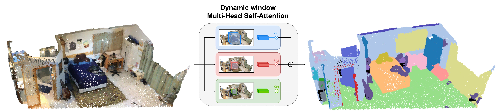
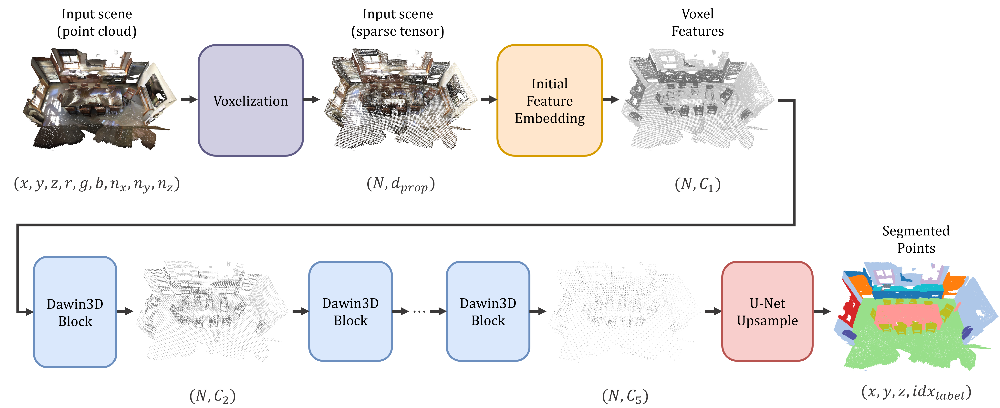
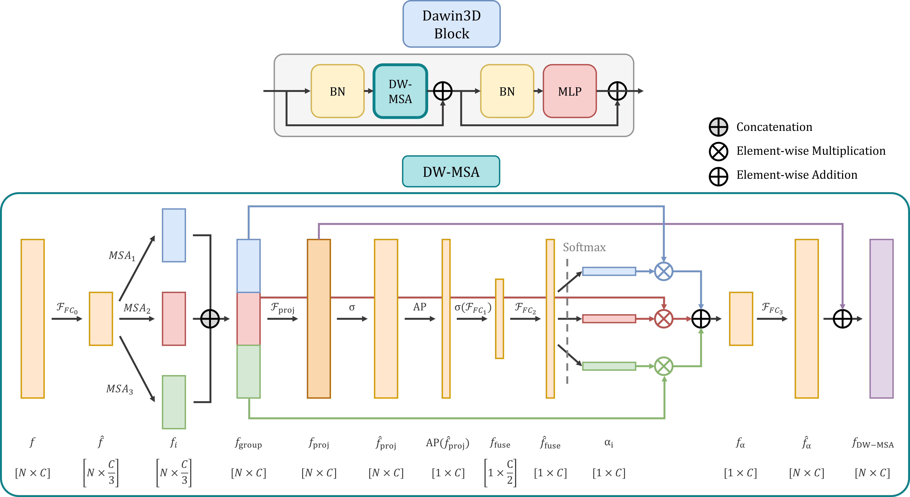
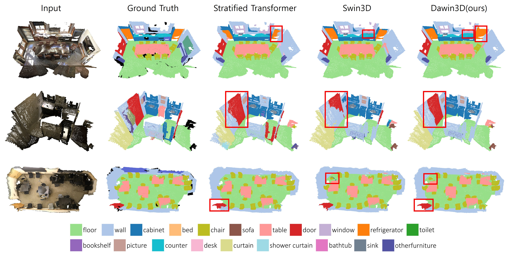
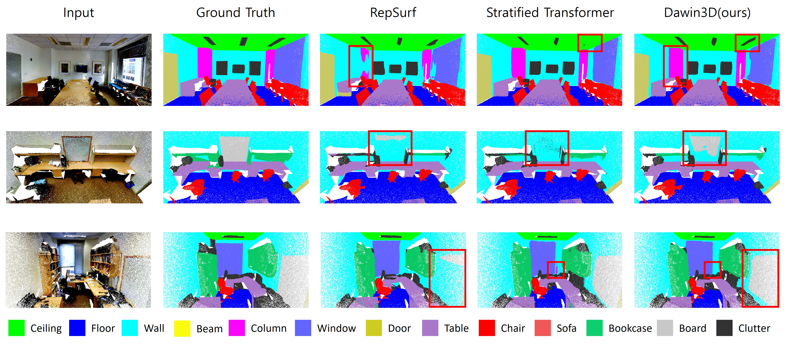

<div align="center">
<h1> Dawin3D </h1>
<h3> Dynamic Window Transformer for 3D Indoor Scene Understanding </h3>

<sup>1</sup> Hyebin Kim ,
<sup>2</sup> Sangmin Yoon,
<sup>1</sup> Jungho Yoon

<sup>1</sup>  Ewha Womans University  
<sup>2</sup>  Kookmin University

📝 Paper: (paper link)

</div>



## Abstract

Conent

## Overview



The model takes either point clouds or meshes as input and utilizes the spatial coordinates and point attributes of scene points to extract discriminative features for segmentation.
First, each scene is voxelized and feature representations are constructed through the Initial Feature Embedding module, which primarily employs sparse convolutional operations to efficiently capture spatial  structures within the voxel grid. 
The initialized voxel features are then progressively refined into high-level representations through a sequene of Dawin3D blocks followed by downsampling, except for the final stage.
Fianlly, a UNet shaped upsampling과 classifier를 통해서 공간의 각 ponit의 semantic label을 예측한다.


## DW-MSA3D



### Semantic Segmenttion on ScanNet (v2) and S3DIS
| Method                 | ScanNet Val mIoU | S3DIS Area 5 | S3DIS 6-fold |
|------------------------|------------------|---------------|---------------|
| KPConv [35]            | 68.4             | 67.1          | 70.6          |
| RepSurf [51]           | 70.0             | 68.9          | 74.3          |
| DeepViewAgg [52]       | 71.0             | 67.2          | 74.7          |
| MinkowskiNet [6]       | 72.1             | 65.4          | -             |
| Point Transformer [32] | -                | 70.4          | 73.5          |
| Stratified Transformer [33] | 74.3      | 72.0          | -             |
| Swin3D-S [34]          | 76.4             | **72.5**      | **76.9**      |
| Swin3D-L [34]          | 74.2             | -             | -             |
| **Dawin3D-S (Ours)**   | **76.4**         | 70.2          | 75.2          |
| **Dawin3D-L (Ours)**   | **76.7**         | 70.3          | 75.4          |


### Visual comparison
**Results on Scannet**


**Results on S3DIS**



## Getting Started

### Installation

**Clone the Dawin3D repository**
```
git clone https://github.com/hyebinny/Dawin3D.git
cd Dawin3d
```

**Environment Setup**

Install the required packages using the `requirements.txt` file:
```
pip install -r requirements.txt

cd Dawin3D_L/Dawin3D_L
python setup.py install
```

Alternatively, you may use Docker (recommended):
```
docker pull yukichiii/torch112_cu113:swin3d
```

## Data Preparation
**ScanNet (v2) Segmentation Data**
Download the dataset from: https://github.com/ScanNet/ScanNet
Refer to: https://github.com/dvlab-research/PointGroup for the ScanNetv2 preprocessing pipeline

**S3DIS Segmentation Data**
Download the dataset from: https://sdss.redivis.com/datasets/9q3m-9w5pa1a2h
Refer to: https://github.com/yanx27/Pointnet_Pointnet2_pytorch for the S3DIS preprocessing pipeline


### Model Training and Inference
**Train model**
```
cd Dawin3D_L/SemanticSeg
python train.py --config config/scannetv2/Dawin3D_RGBN_L.yaml
```

**Test model**
```
cd Dawin3D_L/SemanticSeg
python test.py --config config/scannetv2/Dawin3D_RGBN_L.yaml --vote_num 12 args.weight [ckpt_path]
```
For S3DIS testing, you can modify the `test_area` field in the configuration file to perform inference on each individual area.

## Citation
```
bib
```

## Acknowledgment

This project is based on Swin3D (https://github.com/microsoft/Swin3D.git).
